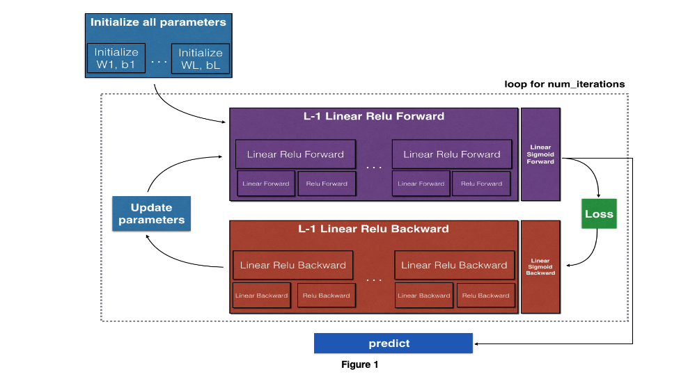
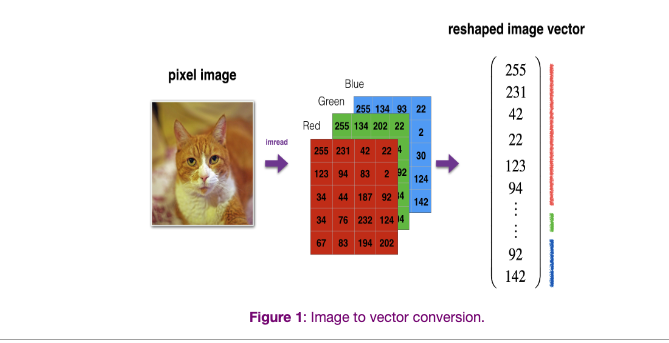
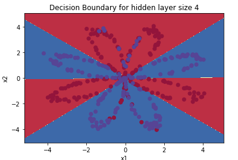

[](https://opensource.org/licenses/MIT)


# Introduction to Neural Networks

This repository contains Jupyter notebooks for the assignments and projects completed as part of the course "Introduction to Neural Networks" within the [Andrew NG deep learning specialization](https://www.coursera.org/learn/neural-networks-deep-learning/) on [Coursera](https://www.coursera.org/]).

## Course Description

This course provides a broad introduction to neural networks and deep learning. I learnt  about the foundations of neural networks, including supervised learning, unsupervised learning, and reinforcement learning. You will also learn about the different types of neural networks, such as feedforward, convolutional, and recurrent neural networks. By the end of this course, you will have a good understanding of the concepts and techniques needed to build and train neural networks, and will be able to apply them to a wide range of applications.

## Notebook list
- **Week 1**: Introduction to neural networks
- **Week 2**: Neural network building blocks
- **Week 3**: Training Neural Networks
- **Week 4**: Regularization and Optimization
- **Week 5**: Structuring Machine Learning Projects
- **Week 6**: Backpropagation and Numerical Stability
- **Week 7**: Evaluation Metrics
- **Week 8**: Tips and Tricks for training deep learning models

## Requirements
- Jupyter Notebook
- Python 3
- Tensorflow 2
- Numpy, Matplotlib, Pandas

## Usage
1. Clone the repository

```
git clone https://github.com/paligonshik/neural_networks.git
```
2. Install the required packages

``` 
pip install -r requirements.txt
```
3. Jupyter Notebook
```
jupyter notebook
```

# [Logistic Regression with a Neural Network mindset](./Logistic%20Regression%20with%20a%20Neural%20Network%20/)
In this repo,

I built the general architecture of a learning algorithm, including:
Initializing my parameters
Calculating the cost function and its gradient
Using an optimization algorithm (gradient descent)
I gathered all three functions above into a main model function, in the right order. Here are couple of functions that I implemented

### Logistic Cost Function
$$J(\theta) = -\frac{1}{m}\sum_{i=1}^{m}[y^{(i)}\log(h_\theta(x^{(i)})) + (1-y^{(i)})\log(1-h_\theta(x^{(i)}))]$$
Where:
- `m` is the number of training examples
- `y` is the true label of the training example
- `x` is the input feature of the training example
- `h(x)` is the predicted label (hypothesis) of the input feature x
- `J(θ)` is the cost function
- `θ` is the weight parameter

### The sigmoid function is defined as:

$$ \sigma(z) = \frac{1}{1 + e^{-z}} $$

Where `z` is the input to the function.


The Backpropagation using Gradient Descent algorithm is defined as:

1. Initialize the weights with random values.
2. Feed forward the inputs through the network and calculate the output.
3. Calculate the error.
4. Propagate the error back through the network using the chain rule of calculus.
5. Calculate the gradient of the cost function with respect to the weights 
   $$ \frac{\partial E}{\partial w_{i,j}} $$
6. Update the weights with the following equation:
   $$ w_{i,j} = w_{i,j} - \alpha \frac{\partial E}{\partial w_{i,j}} $$
7. Repeat steps 2-6 for a fixed number of iterations or until the error reaches a certain threshold.

Where:
- `w_{i,j}` is the weight of the connection between unit i and unit j
- `E` is the error function
- `alpha` is the learning rate

### ReLU:
$$ f(x) = max(0,x) $$

### tanH

$$ f(x) = \frac{e^x - e^{-x}}{e^x + e^{-x}} $$


ReLU is a commonly used activation function in neural networks, it's defined as f(x) = max(0,x). It's computationally efficient, and it helps to prevent the vanishing gradient problem.

tanh is also a commonly used activation function in neural networks, it's defined as f(x) = (e^x - e^-x) / (e^x + e^-x). It outputs values between -1 and 1, which makes it useful in cases where the output of the neuron should be bounded.





# [NN_aplication](./NN_aplication/)
In this repo,

I built my cat/not-a-cat classifier using the functions from the previous assignment to build a deep network. I used the ReLU and tanh activation functions, which helped me to improve the accuracy over my previous logistic regression implementation. I found that ussing a deep network resulted in a higher accuracy for my classifier. I hope this information is helpful for your understanding.




# [Planar data classification with one hidden layer](./Planar%20data%20classification%20with%20one%20hidden%20layer/)
In this repo,

I accomplished building a 2-class classification neural network with a single hidden layer using units with a non-linear activation function, such as tanh. I computed the cross-entropy loss and implemented forward and backward propagation. These techniques helped me to improve the accuracy of my classifier, and I was able to achieve better results than my previous logistic regression implementation on planar data.


